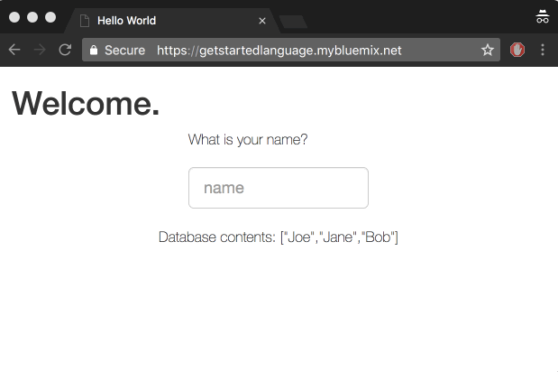

# Liberty getting started application
The Getting Started tutorial for Liberty uses this sample application to provide you with a sample workflow for working with any Liberty app on IBM Cloud or in IBM Cloud Private; you set up a development environment, deploy an app locally and on the cloud, and then integrate an IBM Cloud database service in your app.

The Liberty app may use either the [Cloudant Java Client](https://github.com/cloudant/java-cloudant) or the [MongoDB Java Client](https://mongodb.github.io/mongo-java-driver) to add information to a database and then return information from a database to the UI.

  <kbd>
    
  </kbd>

## Before you begin

You'll need a [IBM Cloud account](https://console.ng.bluemix.net/registration/), [Git](https://git-scm.com/downloads), [Cloud Foundry CLI](https://github.com/cloudfoundry/cli#downloads), and [Maven](https://maven.apache.org/download.cgi) installed. If you use [IBM Cloud Private](https://www.ibm.com/cloud-computing/products/ibm-cloud-private/), you need access to the [IBM Cloud Private Cloud Foundry](https://www.ibm.com/support/knowledgecenter/en/SSBS6K_2.1.0/cloud_foundry/overview.html) environment.

## Instructions

**IBM Cloud Cloud Foundry**: [Getting started tutorial for Liberty](https://console.bluemix.net/docs/runtimes/liberty/getting-started.html#getting-started-tutorial).

**IBM Cloud Kubernetes Service**: [README_kubernetes.md](README_kubernetes.md)

**IBM Cloud Private**: The starter application for IBM Cloud Private guides you through a similar process. However, instead of hosting both your service and application in the same cloud environment, you use a user-provided service. This guide shows you how to deploy your application to IBM Cloud Private and bind it to a Cloudant Database in IBM Cloud. For the complete procedure, see [Working with user-provided services and the Liberty starter app](https://www.ibm.com/support/knowledgecenter/SSBS6K_2.1.0/cloud_foundry/buildpacks/buildpacks_using_Libertyapp.html).

## 
